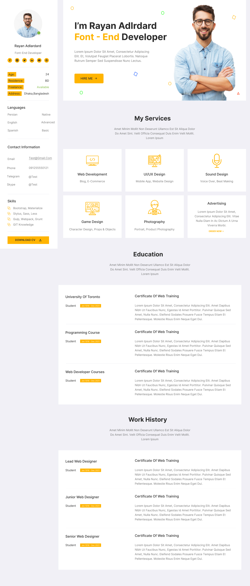
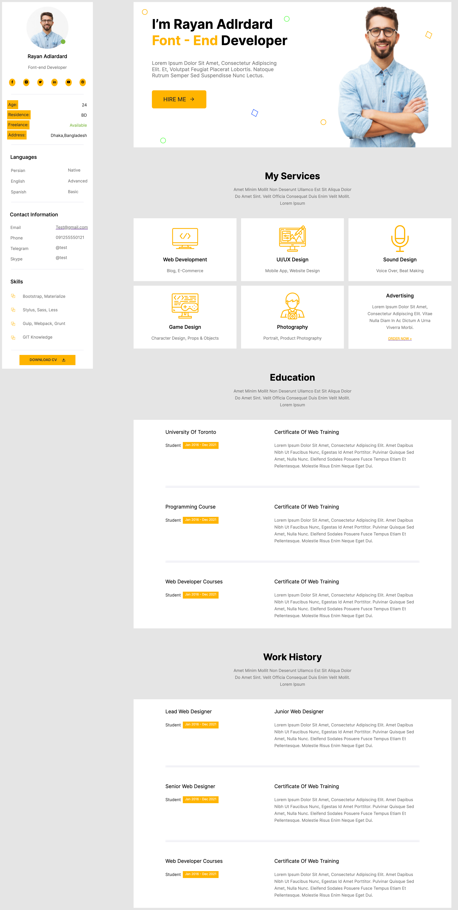
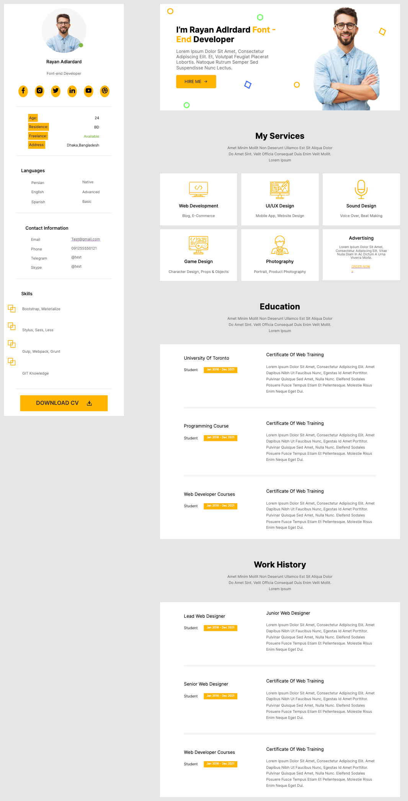
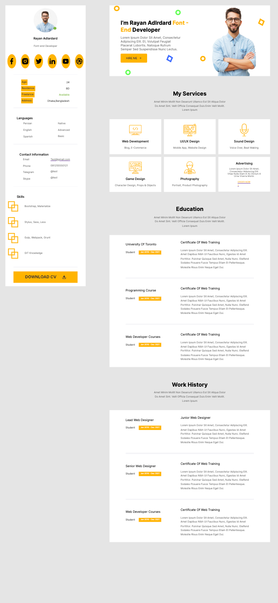

# IE_HW1
First Homework for Internet Engineering (Web Development) Course (Spring 2023)

## Objective
Our task is to create front-end of a CV webpage with html/css. CSS codes are compiled from **.SCSS** file; following image is the objective webpage, we should consider a **responsive** design.  
  

## Result
Following images are 3 demo version of our designed webpage:
- **Desktop Version**
  
- **iPad Air Version**
  
- **Iphone XR Version**  
  

HTML design contains 2 main parts in its body:

- **Sidebar**
- **Main Items**  
Which our Main Items part contains Intro, Services, Work History and Education parts.
